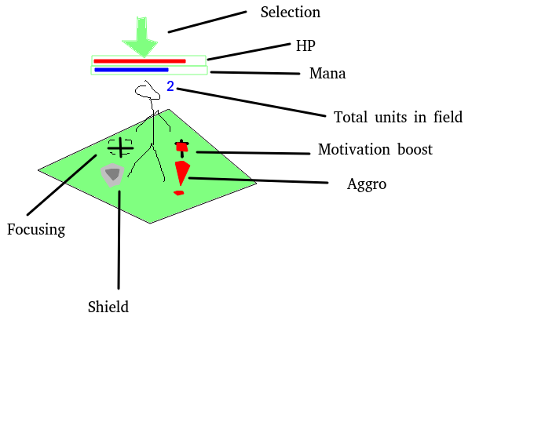

# Summary

- Isometric
- Turn based
- Magic!

VIP moves from point A towards point B every turn. It's your job to keep it alive.

To do so you have a team of 4 characters specialized in each of their own field:

- CA - Fast/Versatile
- CB - Tank
- CC - Healer/Protect
- CD - AoE/Scout

## Turn phases

1. VIP move
2. Player phase
3. Enemy phase

### Phase 1. VIP

VIP moves one step towards portal if not blocked.

### Phase 2. Player

Player may move characters, attack and use abilities until no more is possible.
May end turn at any time.

### Phase 3. Enemy

Aggroed enemy moves towards nearest friendly until it can attack. Will always attack nearest or focused.

## Concepts

Fog of war is used, but the entire map is visible. The path of the VIP is visible.

Enemies are aggro based. Typical zone is point+10 to any character. Aggro'ing an enemy in FoW will aggro it's adjecent enemies. Any enemy aggro'ed will reveal the FoW on and directly adjecent to it. Attacking an enemy will aggro it.

Characters have base attack and abilities. Abilities can be active or activated during combat phase.

Units of same faction can stack.

- Level based on XP
- Alignment - Good <-> Evil. More extreme translates linearly to bonus
- Altitude - Higher is always better
- Initiative - Attack is always better, unless character trait changes that

All attacks have a base damage. The different bonuses will stack on top of that.

Level will modify base stats.

### Stats

- HP
- Mana
- Initiative

## Environment

Isometric view. Terrain is heightmapped.

There can be zones that affect combat effectiveness. Indicated with ground color

## Characters

### VIP

Moves 2 per turn
HP is 100

### CA - Fast

#### Stats

| Level | Moves | Vis | HP  | Range | Attack | Mana | Mana regen |
|-      |-      | -   |-    |-      |-       |-     |-           |
| 1     | 4     | 3   | 100 | 3     | 10     | 50   | 10         |
| 2     | 5     | 3   | 200 | 3     | 12     | 55   | 10         |
| 3     | 6     | 3   | 350 | 4     | 15     | 65   | 10         |

#### Abilities

| Name           | Mana | Cooldown | Notes |
|-               |-     |-         |-      |
| Blink          | 10   | 2        |       |
| Stun           | 20   | 2        |       |
| Auto Disengage | 30   | 2        | Moves out of combat if possible and active and enough mana |

### CB - Tank

#### Stats

| Level | Moves | Vis | HP  | Range | Attack | Mana | Mana regen |
|-      |-      | -   |-    |-      |-       |-     |-           |
| 1     | 2     | 2   | 400 | 1     | 30     | 20   | 10         |
| 2     | 2     | 2   | 500 | 1     | 40     | 30   | 10         |
| 3     | 3     | 2   | 700 | 2     | 60     | 40   | 10         |

#### Abilities

| Name           | Mana | Cooldown | Notes |
|-               |-     |-         |-      |
| Knock          | 10   | 2        | Knock back adjecent enemies |
| Focus          | 10   | 2        | Will force enemies in 2 distance to focus attack CB |
| Shield         | 20   | 2        | Ignore damage this turn |

### CC - Healer/Protect

#### Stats

| Level | Moves | Vis | HP  | Range | Attack | Mana | Mana regen |
|-      |-      | -   |-    |-      |-       |-     |-           |
| 1     | 2     | 3   | 100 | 4     | 5      | 100  | 50         |
| 2     | 2     | 3   | 150 | 4     | 10     | 120  | 50         |
| 3     | 3     | 3   | 200 | 4     | 15     | 150  | 50         |

#### Abilities

| Name           | Mana | Cooldown | Notes |
|-               |-     |-         |-      |
| Heal           | 30   | 2        | Heal target by 50% of missing HP |
| Shield         | 40   | 2        | Reduce damage by 50% for 1 turn |
| Shield all     | 100  | 4        | Reduce damage by 50% for 1 turn for all friendlies |

### CD - AoE/Scout

#### Stats

| Level | Moves | Vis | HP  | Range | Attack | Mana | Mana regen |
|-      |-      | -   |-    |-      |-       |-     |-           |
| 1     | 3     | 5   | 100 | 6     | 10     | 80   | 20         |
| 2     | 3     | 5   | 150 | 7     | 12     | 90   | 20         |
| 3     | 3     | 5   | 300 | 8     | 15     | 100  | 20         |

Attack gives 50% splash in adjecent fields, 25% in distance+1 fields.

#### Abilities

| Name           | Mana | Cooldown | Notes |
|-               |-     |-         |-      |
| Reveal         | 30   | 1        | Reveals FoW at point+4 distance around |
| Motivate       | 50   | 2        | Gives morale boost in point+3 for 2 turns |
| Nuke           | 40   | 2        | Deal 40 damage to all units in point+2 |

## Enemies

| Name        | Moves | Aggro | HP  | Range | Attack | Notes |
|-            |-      |-      |-    |-      |-       |-      |
| Tower       | 0     | 10    | 100 | 15    | 10     ||
| Critter     | 2     | 4     | 10  | 1     | 3      ||
| Orc         | 1     | 5     | 20  | 1     | 10     ||
| Archer      | 2     | 5     | 10  | 4     | 5      ||
| Mage        | 2     | 5     | 15  | 5     | 8      | Attack will slow target by 50% for one turn. |
| Guardian    | 3     | 6     | 40  | 2     | 25     ||

## UI

Each character has HP and mana visible (if any).

Abilities and stats of selection is visible in bottom of screen.

### Control

Clicking a character will select it. Showing stats in bottom. If units are stacked then clicking the field again will cycle them.
